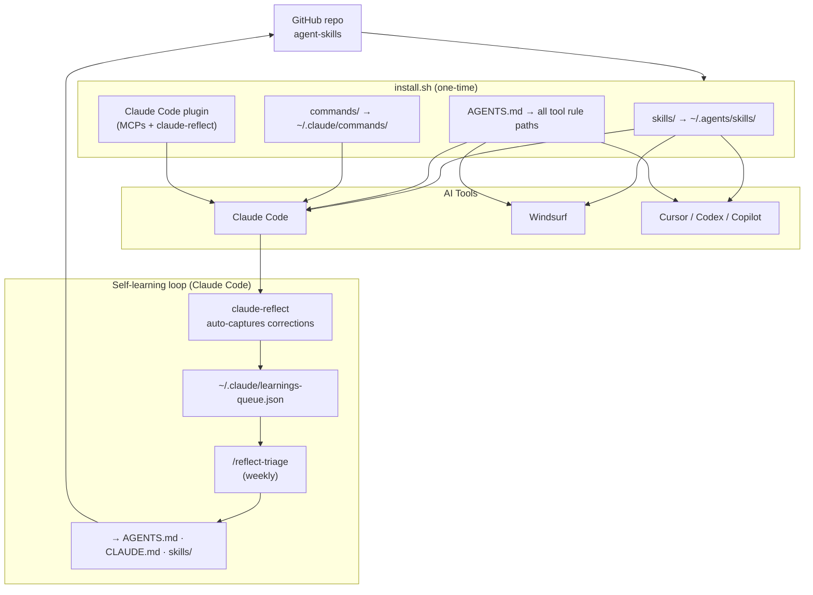

# InnoVestrum Agent Skills

Portable [Agent Skills](https://agentskills.io) and global engineering rules for InnoVestrum — shared across every AI coding tool you use.

## Architecture



## Compatibility

| Feature | Windsurf | Claude Code | Codex CLI | Cursor | Copilot |
|---|:---:|:---:|:---:|:---:|:---:|
| Global rules (`AGENTS.md`) | ✅ | ✅ | ✅ | ✅ | ✅ |
| Skills (`~/.agents/skills/`) | ✅ | ✅ | ✅ | ✅ | ✅ |
| MCP servers (github, context7, brave) | 🔧 | ✅ | 🔧 | 🔧 | ➖ |
| `/reflect-triage` slash command | ❌ | ✅ | ❌ | ❌ | ❌ |
| `claude-reflect` auto-capture | ❌ | ✅ | ❌ | ❌ | ❌ |

> 🔧 = guided setup via `setup-mcps` skill

## Installation

```bash
curl -fsSL https://raw.githubusercontent.com/InnoVestrum/agent-skills/main/install.sh | bash
```

Installs skills, global rules, slash commands, and — if the `claude` CLI is present — the Claude Code plugin (MCPs + `claude-reflect`) automatically.

To update: `git -C ~/.agents/agent-skills pull && bash ~/.agents/agent-skills/install.sh`

**Manual plugin install (Claude Code):**
```bash
claude plugin marketplace add InnoVestrum/agent-skills
claude plugin install innovestrum-standards@innovestrum
```
Then configure API tokens (`claude plugin config innovestrum-standards`) and restart Claude Code.

**MCP setup for other tools:** after install, ask your agent *"set up MCPs"* — it will invoke the `setup-mcps` skill.

## Self-Learning Workflow

Corrections you make during coding are automatically captured by `claude-reflect` and queued. Run `/reflect-triage` weekly to review and route each item:

- `[g]lobal` → appended to `AGENTS.md`, committed and pushed (propagates to all tools via symlink)
- `[p]roject` → written to the local `CLAUDE.md`
- `[s]kill` → new or updated skill via `manage-skills`
- `[d]iscard` → dropped

> Rule of thumb: *"Would this apply to a brand-new project?"* → yes = global, no = project, procedure = skill.

## Skills

| Skill | Description |
|---|---|
| [`manage-rules`](skills/manage-rules) | Add, edit, or delete global engineering rules in `AGENTS.md` |
| [`manage-skills`](skills/manage-skills) | Add, edit, or delete skills in this repository |
| [`manage-commands`](skills/manage-commands) | Add, edit, or delete Claude Code slash commands |
| [`manage-mcps`](skills/manage-mcps) | Add, edit, or remove MCP server declarations |
| [`setup-mcps`](skills/setup-mcps) | Guided MCP setup for Windsurf, Cursor, Codex, and Claude Code |

## Slash Commands

| Command | Description |
|---|---|
| [`/reflect-triage`](commands/reflect-triage.md) | Triage the `claude-reflect` learnings queue with smart routing and human approval |

## Skill Format

Each skill follows the [agentskills.io spec](https://agentskills.io/specification) — YAML frontmatter + Markdown body in `skills/<name>/SKILL.md`. The agent loads only `name` and `description` at startup (progressive disclosure), reading the full file only when the skill is relevant.

See [CONTRIBUTING.md](./CONTRIBUTING.md) to add or improve skills.

## License

[MIT](./LICENSE)
